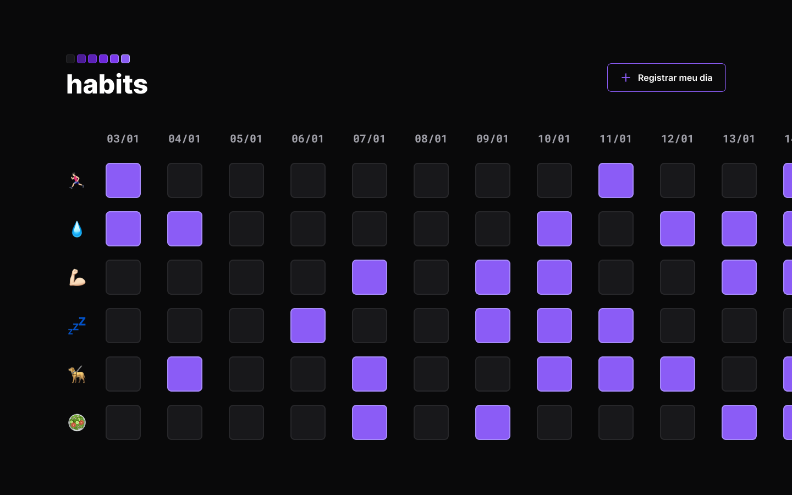

<h1 align="center">Controle de Hábitos (habit tracker)</h1>

Projeto desenvolvido na trilha Explorer do NLW Setup da Rocketseat.

  <a href="#tecnologias">Tecnologias</a>&nbsp;&nbsp;&nbsp;|&nbsp;&nbsp;&nbsp;
  <a href="#projeto">Projeto</a>&nbsp;&nbsp;&nbsp;|&nbsp;&nbsp;&nbsp;
  <a href="#layout">Layout</a>&nbsp;&nbsp;&nbsp;|&nbsp;&nbsp;&nbsp;

---

  ✨ Projeto base:
  

## Tecnologias
Projeto desenvolvido com as seguintes tecnologias:
- HTML
- CSS
- JavaScript
- Git
- Github
- Figma

## Projeto
Desenvolvi esse controle de hábito acompanhando as instruções do Evento gratuito NLW Setup, da RocketSeat. Todos os dias, é possível ativar o botão "Registrar meu dia" para criar uma nova coluna e checar seus hábitos.
- [Acesse o projeto aqui, online!](https://frassing.github.io/habit-tracker-project/) 

Atualmente, o armazenamento de data é pelo navegador, portanto, ao tentar usar em diferentes dispositivos/navegadores, o progresso não estará sincronizado.
A adição, remoção e alteração de dados é feita dentro do código, não dando ao usuário, ainda, uma opção de interação suave.

## Layout
- Para visualizar o layout, acesse [esse link](https://www.figma.com/community/file/1195327109778210238) do Figma (é necessário ter uma conta).
